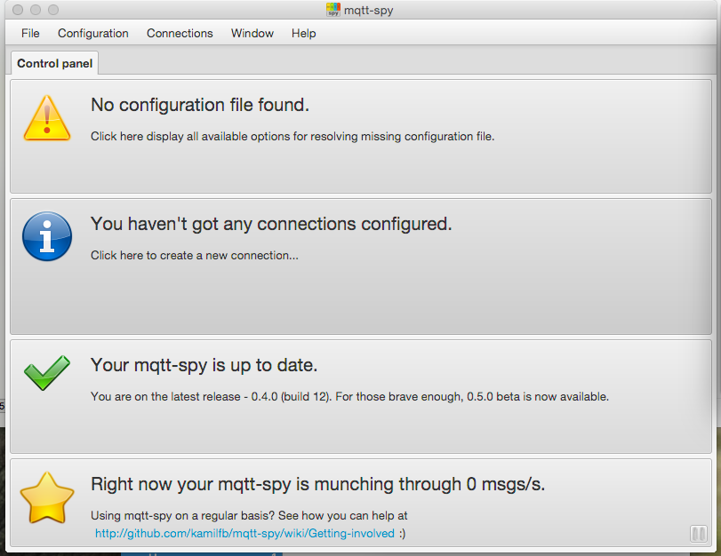

<<<<<<< HEAD:_posts/2016-2-26-mqtt.md
=======
---
layout: post
title: MQTT Info and CLient!
---
>>>>>>> 587ca9659f84cfd3728b0af008b73adfe01ddde3:_posts/2016-2-25-mqtt.md

##MQTT

MQTT is a messaging pub-sub based protocal used by sensors and devices.  

##Message Types

##Client Setup
There are several different clients that can be used with MQTT.

[HiveMQ](http://www.hivemq.com/blog/seven-best-mqtt-client-tools) has a good writeup on the different MQTT clients that are out there.
Here are the ones I've tried:
* AWS Provided console based MQTT
* [MQTT.fx](http://www.jensd.de/apps/mqttfx/)
* [mqtt-spy](https://github.com/kamilfb/mqtt-spy/wiki) **THIS REQUIRES Beta 0.05b6**

I can see some utility in having an IOS or Andorid based MQTT client.  I just haven't been able to test them yet

Regardless of your client choice you will need the following to connect to AWS IoT:
* Endpoint `aws iot describe-endpoint`
  * There is only one endpoint per account!
* A [RootCA](https://www.symantec.com/content/en/us/enterprise/verisign/roots/VeriSign-Class%203-Public-Primary-Certification-Authority-G5.pem) 
* Certificates Generated by AWS IoT for your Device

###mqtt-spy

